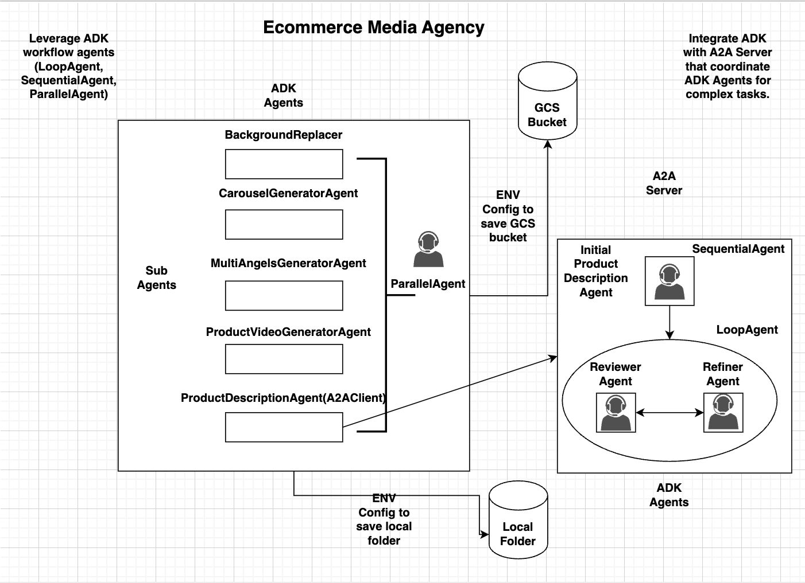

# Product Description A2A Server

A2A Server and Product Description Agents For [Ecommerce Media Agency Project](https://github.com/tsnguyenducphuong/media-agency)

## Introduction:

This project contain an [A2A Server](https://a2aproject.github.io/A2A/specification/) that coordinate several [ADK Agents](https://google.github.io/adk-docs/get-started/quickstart/) that process a request from client (a product image) and generate beautiful product description based on that request. There are Reviewer and Refiner Agents to make sure the description been generated with high quality.

## Architecture Diagram:

The system composed of an A2A Server that exposes an A2A-compliant HTTP endpoint, processing tasks and providing responses.

There are 3 [ADK Agents](https://google.github.io/adk-docs/get-started/quickstart/):

1. **The Initial Produc Desciption Agent**: this Agent takes the request (product image) from client and generate first version of the product description for the product image.

2. **The Reviewer Agent**: this Agent reviews the initial product description and provide feedback how to improve that.

3. **The Refiner Agent**: this Agent takes the feedback and refine the product description until the feedback is good.

The below diagram represents a full workflow in which the [Media Agency agent](https://github.com/tsnguyenducphuong/media-agency) acts as an A2A Client and send product images to the Product Description A2A Server to generate product description.

[Architecture Diagram](https://github.com/tsnguyenducphuong/media-agency/blob/main/docs/ecommerce_media_agency_diagram_full.png)





## How to run:

Following the same steps in this tutorial to deploy the A2A server to Google Cloud:
https://codelabs.developers.google.com/intro-a2a-purchasing-concierge

1.**Go to Cloud Shell Editor and Setup Application Working Directory:**

+ Click on the Open Editor button, this will open a Cloud Shell Editor, we can write our code here.

+ Next, let's clone the template working directory for this codelab from Github, run the following command:

```bash
git clone https://github.com/tsnguyenducphuong/product_description_a2a_server.git
```

+ After that, go to the top section of the Cloud Shell Editor and click File->Open Folder, find your username directory and find the "product_description_a2a_server"

2.**Download uv and install python 3.12 with the following command:**

```bash
curl -LsSf https://astral.sh/uv/0.7.2/install.sh | sh && \
source $HOME/.local/bin/env && \
uv python install 3.13

```

3.**Now let's initialize the virtual environment of the product_description_a2a_server using uv , Run this command:**

```bash

uv sync --frozen
```

4.**Now, we need to prepare the .env variable first, let's copy the .env.example into .env file:**

```bash
cp ~/product_description_a2a_server/.env.example ~/product_description_a2a_server/.env
```

Open Cloud Shell Editor (Toggle hidden files and update the .env with your API Key)

3.**Deploying Product Description - A2A Server to Cloud Run:**
Run the following command:

```bash
gcloud services enable aiplatform.googleapis.com \
                       run.googleapis.com \
                       cloudbuild.googleapis.com \
                       cloudresourcemanager.googleapis.com

gcloud auth login
gcloud config set project ecommerce-media-agency

gcloud run deploy product-description-agent \
           --source ~/product_description_a2a_server \
           --port=8080 \
           --allow-unauthenticated \
           --min 1 \
           --region us-central1
           --timeout=600
```

When asked for enable APIs, select Y:
The following APIs are not enabled on project [ecommerce-media-agency]:
        artifactregistry.googleapis.com
        cloudbuild.googleapis.com
        run.googleapis.com

You would see something like following:

Operation "operations/acf.p2-863901711660-6f6837fd-390a-47a0-a3a3-b9a21c8d3fe1" finished successfully.
Deploying from source requires an Artifact Registry Docker repository to store built containers. A repository named [cloud-run-source-deploy] in region [us-central1] will be
 created.

Do you want to continue (Y/n)?  Y

Once completed successfully, you would see something like:

Service [product-description-agent] revision [product-description-agent-00001-tfv] has been deployed and is serving 100 percent of traffic.
Service URL: https://product-description-agent-86390171XXXX.us-central1.run.app/.well-known/agent.json

If the container deployed successfully, remember to add the environment variables:

Go and check the A2A server: (it should looks like below):

https://product-description-agent-86390171XXXX.us-central1.run.app/.well-known/agent.json